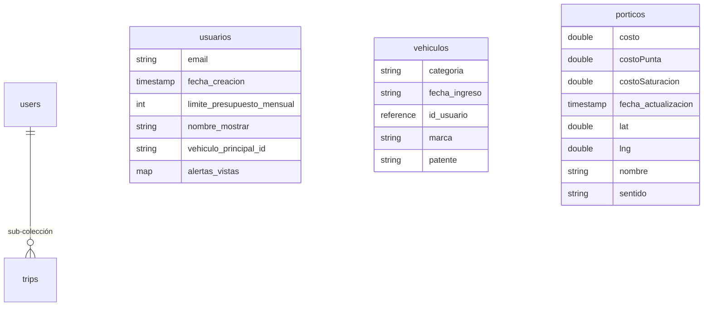

# Informe de Arquitectura de Datos - TAG OK

Este documento detalla la estructura exacta de la base de datos implementada en Google Firebase (Cloud Firestore) para el proyecto Tag OK, verificada según la consola de administración.

## 1. Modelo de Colecciones

El sistema se organiza en cuatro colecciones principales que gestionan la lógica de cobros, usuarios y vehículos.



## 2. Descripción Detallada

### Colección: `porticos`
Base de datos maestra con los puntos de cobro validados.
- **costo**: Tarifa base (TBFP).
- **costoPunta / costoSaturacion**: Tarifas para horarios de alta demanda.
- **sentido**: Orientación del pórtico (ej: "O-P").
- **lat / lng**: Coordenadas geográficas exactas para la detección por GPS.

### Colección: `usuarios`
Almacena el perfil y la configuración de presupuesto del conductor.
- **limite_presupuesto_mensual**: El tope de gasto definido (ej: 70000).
- **alertas_vistas**: Registro de notificaciones enviadas para evitar repeticiones.
- **vehiculo_principal_id**: Patente del auto seleccionado por defecto.

### Colección: `users` / `trips`
Estructura jerárquica para el almacenamiento del historial de viajes.
- **users**: Colección raíz que identifica al usuario.
- **trips**: Sub-colección donde se guarda cada trayecto finalizado de forma independiente.

### Colección: `vehiculos`
Catálogo de autos registrados en la plataforma.
- **id_usuario**: Campo de tipo **Reference** que vincula el auto con su dueño en la colección `usuarios`.
- **patente**: Identificador único del vehículo para el historial.

## 3. Ejemplos de Objetos Reales (JSON)

### Documento en `porticos` (Ej: SB Salida Bellavista)
```json
{
  "nombre": "SB Salida Bellavista",
  "costo": 233.79,
  "costoPunta": 450.11,
  "costoSaturacion": 681.72,
  "lat": -33.4221473,
  "lng": -70.6198252,
  "sentido": "O-P",
  "fecha_actualizacion": "11/05/2026"
}
```

### Documento en `usuarios` (Ej: Perfil de Jesús)
```json
{
  "nombre_mostrar": "Jesús Aranguiz",
  "email": "jesus@gmail.com",
  "limite_presupuesto_mensual": 70000,
  "vehiculo_principal_id": "ABBD23",
  "alertas_vistas": {
    "2026-5_50": true,
    "2026-5_75": true
  },
  "fecha_creacion": "04/05/2026"
}
```

---
*Documentación técnica final sincronizada con la consola Firebase y exportación JSON adjunta - Mayo 2026*
